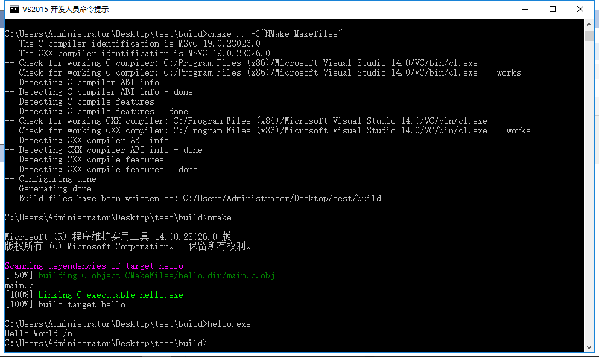
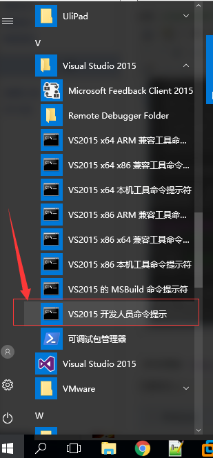


# WINDOWS CMAKE与NMAKE

---

在Linux下编库经常会使用CMakeLists.txt文件，然后一个cmake 再一个make就可以编译出来。

在Windows下有cmake，但是cmake出来是一个Visual Studio工程，然后搜索windows下能不能用make,结果是要安装MinGW，然后就放弃了。

最近看到windows下可以使用cmake和nmake的组合编译程序，记录下来。

先看一个结果：



一个简单的c程序，文件名为main.c,放在桌面test文件夹下：

```
//main.c
#include <stdio.h>
int main()
{
    printf("Hello World!\n");
    return 0;
}
```
编写CMakeLists.txt文件，放在test文件夹下：

```
project(HELLO)
set(SRC_LIST main.c)
add_executable(hello ${SRC_LIST})
```

在test文件夹下新建一个build文件夹，进入build文件夹：

然后打开下面的命令窗口：



进入后如下所示：



 使用命令进入build文件夹：

```
cd /d C:\Users\Administrator\Desktop\test\build
```

执行cmake与nmake:

```
cmake .. -G"NMake Makefiles"
nmake
```

执行完毕会生成一个hello.exe，在命令窗口继续执行：

```
hello.exe
```

就会输出结果：

```
Hello World!

```

正如文章开头看到的一样。

参考博客：https://blog.csdn.net/dbzhang800/article/details/6314073

参考博客：https://blog.csdn.net/graduate_2017/article/details/70752770?t=1514901314692

